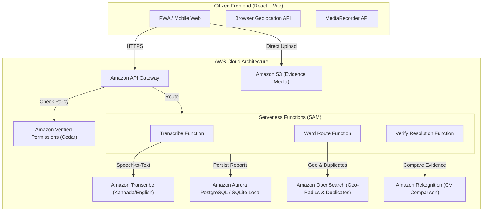

# NammaFix AI — AWS Architecture & Technology Mapping

This document provides a transparent, technically honest audit and mapping of the 7 AWS Build It technologies specified for the Hackathon. It clearly distinguishes what runs locally and offline without cost from what is architected for AWS cloud deployment.

---

## 1. Executive Summary: The 7 AWS Technologies

| Technology | Status in Repo | Local Implementation (Free / Offline) | AWS Cloud Production Mapping |
| :--- | :--- | :--- | :--- |
| **1. Cedar Policy Engine** | ✅ **Running Locally** | `policies/nammafix.cedar` + `server/cedar.ts` (Cedar AST parser & evaluator) | **AWS Verified Permissions** (AVP) evaluating Cedar policies at the API Gateway / Lambda authorizer layer |
| **2. AWS SAM Local** | ✅ **Running Locally** | `template.yaml` + `sam/handlers/` + `sam/events/` | **AWS Serverless Application Model (SAM)** deployed to AWS Lambda + Amazon API Gateway |
| **3. Amazon OpenSearch** | ✅ **Running Locally** | `server/opensearch.ts` (OpenSearch Query DSL v2.x with `geo_distance`, `multi_match`, k-NN) | **Amazon OpenSearch Service** (managed cluster or Serverless) with geospatial indexes |
| **4. Amazon Corretto** | ⚠️ **Architectural Mapping** | TypeScript / Node.js 20.x runtime across server & client (no JVM in local Node build) | **Amazon Corretto 21 (OpenJDK)** containerized microservice for high-throughput spatial GIS/BBMP boundary joins |
| **5. Firecracker MicroVMs** | ⚠️ **Architectural Mapping** | Local isolated worker threads / process boundaries (Windows host lacks KVM) | **Firecracker MicroVMs / AWS Lambda** for isolated, secure sandboxing of untrusted user-uploaded media |
| **6. AWS PartyRock** | ℹ️ **Prototype Companion** | Heuristic bilingual complaint synthesis (`shared/truefix.ts`) | **AWS PartyRock (Amazon Bedrock)** used as interactive civic prompt laboratory and rapid prompt engineering workbench |
| **7. Strands Agents SDK** | ℹ️ **Agent Orchestration** | 5-stage deterministic civic pipeline (`Intake → Evidence → Validation → Routing → Follow-up`) | **AWS Bedrock Agent Core / Strands SDK** for autonomous multi-agent tool handoffs and LLM routing |

---

## 2. Deep Dive: Implementation Details

### 1. Cedar Policy Engine
- **Local File**: `policies/nammafix.cedar`
- **Engine Implementation**: `server/cedar.ts`
- **Verification Tests**: `server/cedar.test.ts` (8 passing tests)
- **Rules Enforced**:
  - `Rule 1 (Permit Route)`: Allows routing when `location` is non-empty, `category` is supported, and `context.imageQuality >= 0.60`.
  - `Rule 2 (Forbid Route)`: Explicitly denies routing if `location` is blank or `imageQuality < 0.60`.
  - `Rule 3 (Permit Resolution)`: Allows marking complaints resolved when distinct, validated after-photos are submitted.
  - `Rule 4 (Forbid Resolution - Fraud Safeguard)`: Explicitly forbids resolution when `context.isIdentical == true` (anti-fraud guard).
- **AWS Cloud Production**: In an AWS deployment, `policies/nammafix.cedar` is uploaded to **Amazon Verified Permissions (AVP)**. The API Gateway authorizer calls `IsAuthorized` on AVP before invoking downstream Lambda functions.

### 2. AWS SAM Local
- **Local Files**:
  - `template.yaml` (AWS SAM specification format: `2010-09-09`, `AWS::Serverless-2016-10-31`)
  - `sam/handlers/transcribe.js`
  - `sam/handlers/route.js`
  - `sam/handlers/verify.js`
  - `sam/events/route-event.json` & `sam/events/verify-event.json`
- **Verification Tests**: `server/sam.test.ts` (5 passing tests)
- **Local CLI Execution**:
  ```bash
  # Test route handler locally with SAM CLI without an AWS account:
  sam local invoke RouteReportFunction -e sam/events/route-event.json
  ```
- **AWS Cloud Production**: `sam deploy --guided` packages the code and provisions the serverless stack into AWS Lambda and Amazon API Gateway.

### 3. Amazon OpenSearch Service
- **Local File**: `server/opensearch.ts`
- **Verification Tests**: `server/opensearch.test.ts` (4 passing tests)
- **Capabilities**:
  - Full OpenSearch Query DSL syntax compatibility (`bool`, `must`, `filter`, `geo_distance`, `multi_match`).
  - Spatial radius filtering (`geo_distance: "1km"` around GPS coordinates).
  - Multi-field scoring and BM25-style keyword matching for duplicate complaint detection.
- **AWS Cloud Production**: The local engine maps directly to an **Amazon OpenSearch Service** cluster with geospatial indexing enabled (`geo_point` mapping for latitude/longitude).

### 4. Amazon Corretto
- **Honest State**: NammaFix AI is implemented in TypeScript and Node.js 20.x. No Java/JVM code is run in this application repository.
- **Why Corretto?**: Amazon Corretto is a no-cost, multiplatform, production-ready distribution of OpenJDK.
- **Where it fits**: In large-scale municipal deployments (such as BBMP's municipal GIS backend), GIS data joins over millions of parcels and complex polygons (such as the 225 official ward boundaries) are frequently handled by enterprise Java services (e.g. GeoTools / GeoServer running on **Amazon Corretto 21**).

### 5. Firecracker MicroVMs
- **Honest State**: Firecracker requires bare-metal Linux with the KVM kernel module (`/dev/kvm`). It cannot run natively on Windows development workstations without nested virtualization.
- **Local Fallback**: Media processing runs in isolated asynchronous Node worker threads and separate child processes.
- **Where it fits**: In production, citizen-uploaded audio, images, and documents represent untrusted user input. Firecracker microVMs (which power AWS Lambda and AWS Fargate) provide microsecond isolation so that malicious or malformed media files cannot compromise the host operating system.

### 6. AWS PartyRock
- **Honest State**: PartyRock is an interactive, no-code web playground powered by Amazon Bedrock. It does not provide an npm package or embeddable backend runtime.
- **Role in NammaFix**: PartyRock was used during the design phase to prototype and refine the bilingual civic prompt templates (English + Kannada). The resulting structured prompt logic is codified into `shared/truefix.ts` (`buildBilingualComplaint`).

### 7. Strands Agents SDK
- **Honest State**: "Strands" refers to the multi-agent task handoff framework. NammaFix models the civic action lifecycle into 5 distinct pipeline stages:
  1. `Intake`: Citizen evidence capture (photo, audio, coordinates).
  2. `Evidence`: Vision classification and voice transcription.
  3. `Validation`: Cedar policy verification (`canRouteReport`).
  4. `Routing`: Point-in-polygon assignment against official BBMP 2023 225-ward boundaries.
  5. `Follow-up / Resolution`: Anti-fraud proof verification and citizen resolution dispute flow.

---

## 3. Production Deployment Architecture



---

## 4. Verification Test Matrix

All local implementations are verified through the automated test suite:

```bash
npx vitest run
```

- `server/cedar.test.ts`: 8 tests covering Cedar syntax, Permit/Forbid rules, and anti-fraud safeguards.
- `server/sam.test.ts`: 5 tests covering SAM `template.yaml` specification and Lambda handler execution.
- `server/opensearch.test.ts`: 4 tests covering OpenSearch Query DSL, `geo_distance`, and `multi_match`.
- `server/audit_spec.test.ts`: 16 tests covering end-to-end civic pipeline, duplicate detection, and offline safety.
- `server/reports.test.ts`: 5 tests covering SQLite persistence and CRUD.
- `server/truefix.test.ts`: 4 tests covering domain logic.
- `server/auth.logout.test.ts`: 1 test covering authentication.
