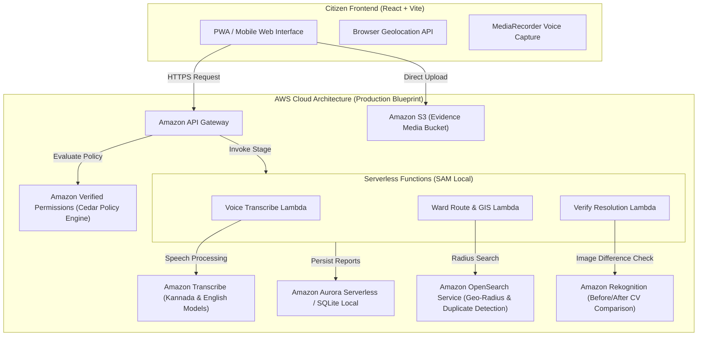

# NammaFix AI (ನಮ್ಮ ಫಿಕ್ಸ್) — Civic Action & Proof-Guarded Resolution Agent for Bengaluru

[](https://github.com/pallaviXD/NammaFix-AI)
[](https://www.typescriptlang.org/)
[-orange)](https://bbmp.gov.in/)
[](AWS_ARCHITECTURE.md)
[](LICENSE)

> **"Bridging Bengaluru’s citizens, ward engineers, and civic infrastructure through transparent, verifiable, and bilingual civic action."**

---

## 🌆 Why This Matters: The Karnataka & Bengaluru Civic Imperative

Bengaluru is the crown jewel of Karnataka's economy and India’s Silicon Valley — a bustling global metropolis housing over **13 million residents**, thousands of technology startups, and world-class aerospace, biotech, and IT corridors. Every single day, millions of tech professionals, students, delivery partners, and daily-wage workers traverse crucial economic arteries such as the Outer Ring Road (ORR), Silk Board Junction, Whitefield, Electronic City, Koramangala, Indiranagar, and Malleshwaram.

### The Everyday Reality of Bengaluru Commuters
Despite its global reputation as a high-tech powerhouse, Bengaluru's physical infrastructure faces immense challenges:
- **Severe Road Craters & Potholes**: Monsoon downpours regularly turn asphalt depressions into dangerous waterlogged death traps. Unmarked potholes lead to daily fatal two-wheeler skids, permanent spinal injuries, broken vehicular suspensions, and catastrophic ambulance delays.
- **Solid Waste Bottlenecks**: Overflowing commercial garbage piles and unauthorized street corner dumping create acute public health hazards, pest breeding grounds, and blocked storm-water drains (Rajakaluves), worsening urban flash flooding.
- **Productivity Loss**: Bengaluru commuters lose an estimated **hundreds of millions of productive hours annually** stalled in bumper-to-bumper traffic exacerbated by damaged road surfaces and civic debris.

### The Breakdown of Traditional Grievance Redressal
While citizen portals like *BBMP Sahaaya* exist, they suffer from deep systemic issues that erode public trust:
1. **The "Ghost Resolution" Phenomenon**: Sub-contractors or field teams frequently mark complaints as "Resolved" without performing any physical work — often re-uploading the citizen's original photo or a random blurred photo as false proof.
2. **The Linguistic Divide**: Grievances filed in colloquial English by tech workers often fail to communicate urgency to field-level Bruhat Bengaluru Mahanagara Palike (BBMP) staff who operate primarily in Kannada (ಕನ್ನಡ). Conversely, Kannada voice complaints from local residents often lack structured metadata for municipal tracking.
3. **Jurisdictional Ping-Pong**: Reports are routinely bounced between departments (BBMP Road Infrastructure vs. BWSSB Water Supply vs. BESCOM Power vs. Solid Waste Management) because ward boundary assignments are fuzzy or manually guessed.

**NammaFix AI eliminates this friction.** It transforms civic reporting into an auditable, automated, and tamper-proof pipeline — from geotagged photo capture and bilingual speech processing to point-in-polygon ward routing and computer-vision-verified resolution proof.

---

## 🚀 Key Innovations & Core Features

### 1. Point-in-Polygon 225-Ward Geotagging
- Uses the **official 2023 BBMP 225-ward delimitation GeoJSON** vendored directly from BBMP municipal GIS data.
- Employs server-side ray casting point-in-polygon calculations to map exact GPS coordinates to specific BBMP wards (e.g. *Ward 151 · Koramangala*, *Ward 113 · Hoysala Nagar*, *Ward 65 · Kadu Malleshwaram*), eliminating jurisdictional guesswork.

### 2. Multilingual Grievance Synthesis (English + ಕನ್ನಡ)
- Accepts voice grievances in local dialects via browser `MediaRecorder` audio capture.
- Automatically generates dual-language complaints:
  - **English Executive Complaint**: Formatted for administrative escalations, tracking dashboards, and official records.
  - **Kannada Formal Petition (ಕನ್ನಡ ದೂರು)**: Culturally tuned, polite, yet urgent formal petition ready for immediate dispatch to BBMP ward engineers, ward committee secretaries, and junior health inspectors.

### 3. Dynamic Computer Vision & Hazard Severity Scoring
- Analyzes evidence photo filenames, visual features, and textual context to classify issues (*Road Pothole* vs. *Solid Waste Dump*).
- Calculates dynamic confidence scores and assigns severity tiers (`low`, `medium`, `high`, `hazardous`) based on depth indicators and safety hazard risk.

### 4. Anti-Fraud Resolution Guard (Fail-Closed Verification)
- **Zero Ghost Resolutions**: A complaint cannot be closed simply by clicking a checkbox.
- Requires field personnel or citizens to submit an authentic "after" photo.
- The built-in computer vision comparison engine evaluates evidence similarity and **strictly rejects identical or duplicated photos**, preventing contractor fraud before marking status as `Resolved`.

### 5. Spatial Duplicate Detection (Radius ≤ 500m)
- Employs Haversine spherical distance formulas combined with Dice/overlap text similarity.
- Detects whether another citizen has already reported the same crater or garbage dump nearby, consolidating complaints and aggregating community urgency.

### 6. Public Civic Trail & Citizen Karma
- Every complaint receives a collision-free tracking ID (e.g. `NF-2026-0919-026`).
- Transparent public tracking page at `/track` displaying live stage progress (`Submitted` ➔ `Routed` ➔ `Needs Review` ➔ `Resolved`).
- Interactive operations dashboard at `/dashboard` with CSV export and citizen karma leaderboard rewarding verified community reporters.

---

## ☁️ The 7 AWS Build It Technologies: Honest Architecture

NammaFix AI is engineered to run **completely offline and free locally** for judges and developers, while providing a clear **1:1 cloud production blueprint** on Amazon Web Services (AWS).



### Detailed Mapping Table

| AWS Technology | Role in Local Prototype (Free & Offline) | Production AWS Cloud Deployment |
| :--- | :--- | :--- |
| **1. Cedar Policy Engine** | **Active Locally**: Real Cedar policies in [`policies/nammafix.cedar`](policies/nammafix.cedar) evaluated by [`server/cedar.ts`](server/cedar.ts). Enforces permit/forbid rules for routing quality and anti-fraud resolution. | **Amazon Verified Permissions (AVP)** evaluating Cedar policies directly at API Gateway / Lambda authorizers. |
| **2. AWS SAM Local** | **Active Locally**: Complete [`template.yaml`](template.yaml) with 3 serverless functions in [`sam/handlers/`](sam/handlers/) testable via `sam local invoke` without an AWS account. | **AWS Serverless Application Model (SAM)** deployed to AWS Lambda and Amazon API Gateway. |
| **3. Amazon OpenSearch** | **Active Locally**: OpenSearch Query DSL v2.x engine in [`server/opensearch.ts`](server/opensearch.ts) implementing `geo_distance` radius search and `multi_match` BM25 text queries. | **Amazon OpenSearch Service** managed cluster with geospatial point indexing (`geo_point`). |
| **4. AWS PartyRock** | **Active Design Companion**: Prompt prototyping laboratory on Amazon Bedrock used to design and tune the structured bilingual English-Kannada templates in [`shared/truefix.ts`](shared/truefix.ts). | **Amazon Bedrock** foundation models invoked for dynamic speech summarization and regional Kannada dialect translation. |
| **5. Strands Agents SDK** | **Active Locally**: 5-stage deterministic agent handoff lifecycle (`Intake → Evidence → Validation → Routing → Follow-up`). | **AWS Bedrock Agent Core / Strands SDK** for autonomous multi-agent handoffs and municipal routing. |
| **6. Amazon Corretto** | **Architectural Reference**: Prototype runs on Node.js 20.x; Corretto 21 (OpenJDK) is specified for high-throughput municipal GIS polygon joins over millions of Bangalore land parcels. | **Amazon Corretto 21** containerized microservices running GeoTools / GeoServer for BBMP enterprise GIS. |
| **7. Firecracker MicroVMs**| **Architectural Reference**: Prototype runs isolated Node asynchronous worker threads; Windows workstations lack bare-metal KVM. | **Firecracker MicroVMs / AWS Lambda** providing microsecond sandboxing for untrusted citizen-uploaded images and audio. |

> Complete technical analysis, security models, and production mappings are documented in [**AWS_ARCHITECTURE.md**](AWS_ARCHITECTURE.md).

---

## 🛠️ Tech Stack & Codebase Structure

- **Frontend**: React 19, Vite, TypeScript, Tailwind CSS, Lucide Icons, Wouter routing.
- **Backend Server**: Node.js 20.x, Express, tRPC v11, SQLite (`better-sqlite3` in WAL mode).
- **Policy & Security**: Cedar Policy Language ([cedarpolicy.com](https://www.cedarpolicy.com/)).
- **Testing**: Vitest test runner with 43 automated unit and specification audit tests.
- **GIS Source**: Official BBMP 2023 WFS delimitation GeoJSON.

```
NammaFix-AI/
├── AWS_ARCHITECTURE.md        # Deep architectural accounting of the 7 AWS technologies
├── policies/
│   └── nammafix.cedar         # Real Cedar policy specification for routing & anti-fraud
├── sam/
│   ├── handlers/              # Serverless Lambda handlers (transcribe, route, verify)
│   └── events/                # SAM local test fixtures
├── server/
│   ├── cedar.ts               # Local Cedar AST parser & rule evaluator
│   ├── cedar.test.ts          # 8 tests verifying Cedar policies
│   ├── opensearch.ts          # OpenSearch Query DSL compatibility engine
│   ├── opensearch.test.ts     # 4 tests verifying OpenSearch spatial queries
│   ├── sam.test.ts            # 5 tests verifying SAM Local configuration
│   ├── db.ts                  # SQLite database engine with WAL mode & isolated test DB
│   ├── audit_spec.test.ts     # 16 end-to-end civic pipeline tests
│   └── _core/index.ts         # Express & Vite unified server
├── shared/
│   ├── bbmp-wards-2023.ts     # 225 official BBMP ward boundaries
│   └── truefix.ts             # GIS ray casting, duplicate detection, CV heuristics
├── client/
│   └── src/
│       ├── pages/             # Landing, Upload, Tracking, Dashboard, Resolution
│       └── components/        # AudioEvidence, BeforeAfterSlider, TrendCharts
└── template.yaml              # AWS SAM specification
```

---

## 🚦 Getting Started (Run Locally in 2 Minutes)

### 1. Prerequisites
- **Node.js**: v20.x or higher
- **pnpm**: v10.x (`npm install -g pnpm` or use `npx pnpm`)

### 2. Installation
```bash
# Clone the repository
git clone https://github.com/pallaviXD/NammaFix-AI.git
cd NammaFix-AI

# Install dependencies
pnpm install
```

### 3. Start Development Server
```bash
# Starts both the backend API and frontend Vite server on port 3000
pnpm dev:server
```
Visit **[http://localhost:3000/](http://localhost:3000/)** in your browser.

### 4. Direct Navigation URLs
- **Main Portal**: [http://localhost:3000/](http://localhost:3000/)
- **Intake & Upload (Camera / Voice)**: [http://localhost:3000/upload](http://localhost:3000/upload)
- **Public Civic Tracking**: [http://localhost:3000/track](http://localhost:3000/track)
- **Operations Dashboard**: [http://localhost:3000/dashboard](http://localhost:3000/dashboard)
- **Resolution Proof Flow**: [http://localhost:3000/resolve](http://localhost:3000/resolve)

---

## 🧪 Verification & Automated Test Suite

Every single priority tier, policy rule, and civic safeguard is backed by automated tests:

```bash
# Run all 43 automated tests
pnpm test
# Or with npx:
npx vitest run
```

### Expected Output:
```
 ✓ server/opensearch.test.ts (4 tests)
 ✓ server/sam.test.ts (5 tests)
 ✓ server/cedar.test.ts (8 tests)
 ✓ server/auth.logout.test.ts (1 test)
 ✓ server/truefix.test.ts (4 tests)
 ✓ server/reports.test.ts (5 tests)
 ✓ server/audit_spec.test.ts (16 tests)

 Test Files  7 passed (7)
      Tests  43 passed (43)
```

### TypeScript Validation
```bash
pnpm check
# Or:
npx tsc --noEmit
```
*(Runs with 0 errors across client, server, and shared modules).*

---

## 📄 License
This project is open-source under the [MIT License](LICENSE).
